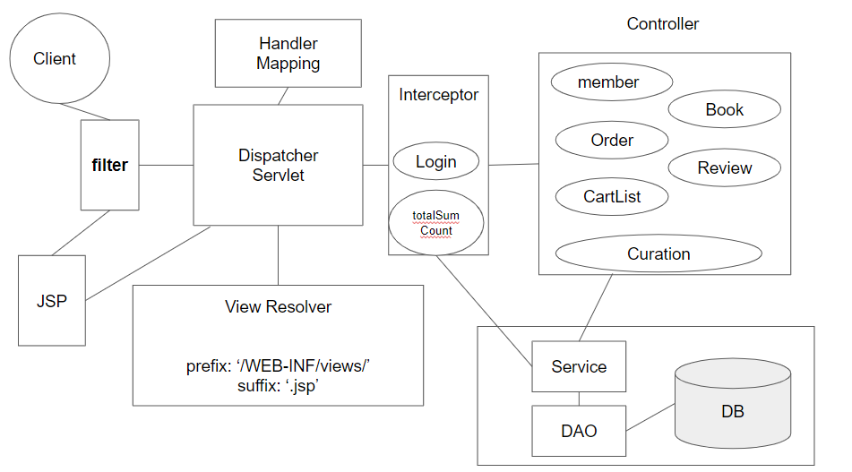

# Spring Framework soa 리팩토링

## 변경사항

 

- 기존 JSP/Servlet 버전에서 SOA (Service-Oriented Architecture)방식으로 전부 리팩토링 했습니다.
- 재은님이 설계 하셨던 카트, 주문 파트를 세션을 이용한 방식이 아닌 DB를 이용한 방식으로 설계했습니다.
- 몇 가지 form 객체 전달 부분은 PRG 패턴을 이용해서 설계했습니다.
- 장바구니와 주문하기 부분을 DB를 활용해 설계했기 때문에 CartDTO를 추가했습니다.
- 세션에 카트 수량을 카운트 하는 부분은 중복 코드를 줄이고 Interceptor 를 활용했습니다.

 

 

## 아키텍쳐

 

 

## 개발 환경

 

### 의존성 라이브러리 

- Spring Framework &nbsp;&nbsp;&nbsp;&nbsp;&nbsp;  4.3.30 Release
- slf4j  &nbsp;&nbsp;&nbsp;&nbsp;&nbsp; &nbsp;&nbsp;&nbsp;&nbsp;&nbsp;  &nbsp;&nbsp;&nbsp;&nbsp;&nbsp;  &nbsp;&nbsp;&nbsp;&nbsp;&nbsp;  &nbsp;&nbsp;&nbsp;&nbsp;  1.6.6
- asectj  &nbsp;&nbsp;&nbsp;&nbsp;&nbsp;  &nbsp;&nbsp;&nbsp;&nbsp;&nbsp;  &nbsp;&nbsp;&nbsp;&nbsp;&nbsp;  &nbsp;&nbsp;&nbsp;&nbsp;&nbsp;  &nbsp;&nbsp;1.6.10
- Inject  &nbsp;&nbsp;&nbsp;&nbsp;&nbsp;  &nbsp;&nbsp;&nbsp;&nbsp;&nbsp;  &nbsp;&nbsp;&nbsp;&nbsp;&nbsp;  &nbsp;&nbsp;&nbsp;&nbsp;&nbsp;  &nbsp;&nbsp;1
- servlet-api  &nbsp;&nbsp;&nbsp;&nbsp;&nbsp;  &nbsp;&nbsp;&nbsp;&nbsp;&nbsp;  &nbsp;&nbsp;&nbsp;&nbsp;&nbsp;  2.1
- jsp-api &nbsp;&nbsp;&nbsp;&nbsp;&nbsp; &nbsp;&nbsp;&nbsp;&nbsp;&nbsp; &nbsp;&nbsp;&nbsp;&nbsp;&nbsp; &nbsp;&nbsp;&nbsp;&nbsp;&nbsp; 2.1
- jstl &nbsp;&nbsp;&nbsp;&nbsp;&nbsp; &nbsp;&nbsp;&nbsp;&nbsp;&nbsp; &nbsp;&nbsp;&nbsp;&nbsp;&nbsp; &nbsp;&nbsp;&nbsp;&nbsp;&nbsp; &nbsp;&nbsp;&nbsp;&nbsp;&nbsp; 1.2
- junit &nbsp;&nbsp;&nbsp;&nbsp;&nbsp; &nbsp;&nbsp;&nbsp;&nbsp;&nbsp;  &nbsp;&nbsp;&nbsp;&nbsp;&nbsp; &nbsp;&nbsp;&nbsp;&nbsp;&nbsp; &nbsp;&nbsp;&nbsp; 4.7
- mybatis &nbsp;&nbsp;&nbsp;&nbsp;&nbsp; &nbsp;&nbsp;&nbsp;&nbsp;&nbsp; &nbsp;&nbsp;&nbsp;&nbsp;&nbsp; &nbsp;&nbsp;&nbsp; 3.4.6
- mybatis-spring &nbsp;&nbsp;&nbsp;&nbsp;&nbsp; &nbsp;&nbsp;&nbsp;&nbsp;1.3.2
- ojdbc6 &nbsp;&nbsp;&nbsp;&nbsp;&nbsp; &nbsp;&nbsp;&nbsp;&nbsp;&nbsp; &nbsp;&nbsp;&nbsp;&nbsp;&nbsp; &nbsp;&nbsp;&nbsp;&nbsp;   11.2.0.1.0
- spring-jdbc &nbsp;&nbsp;&nbsp;&nbsp;&nbsp; &nbsp;&nbsp;&nbsp;&nbsp;&nbsp; &nbsp;&nbsp;&nbsp; 5.0.8.RELEASE
- commons-dbcp2 &nbsp;&nbsp;&nbsp;&nbsp;&nbsp;&nbsp; 2.5.0
- jackson-databind &nbsp;&nbsp;&nbsp;&nbsp;&nbsp;&nbsp; 2.8.8
- mail &nbsp;&nbsp;&nbsp;&nbsp;&nbsp;&nbsp; &nbsp;&nbsp;&nbsp;&nbsp;&nbsp;&nbsp; &nbsp;&nbsp;&nbsp;&nbsp;&nbsp;&nbsp; &nbsp;&nbsp;&nbsp;&nbsp;&nbsp;&nbsp; 1.4.7
- spring-context-support  4.3.30 Release

 

### 자바 버전
- JDK 1.8

 

### DB
- orcle 11g Express Edtion

 

### Build Tool
- Maven &nbsp;&nbsp;&nbsp;&nbsp;&nbsp;&nbsp; 2.5.1

 

### IDE
- STS &nbsp;&nbsp;&nbsp;&nbsp;&nbsp;&nbsp;  3.9.14.RELEASE

 

 

## 리팩토링 적용 철학

 

### 기능 자체를 수정하지 않는다.
 - 코드의 구조는 바뀔 수 있지만 각 기능은 그대로 유지한다.

### 심플해야한다.
 - 코드의 가독성을 높이기 위함.

### 꼼꼼히 기록을 남긴다.
-  팀원들의 코드를 리팩토링했기 때문에 쉽고 빠르게 이해하기 위해서 각 기능 또는 버그 수정 시 커밋을 작성한다.

 

 

## Trouble Shooting

 
 

문제점1: 기존 장바구니에 담겨있는 총 수량 업데이트 기능을 수행하기 위해 여러 코드에 중복되는 코드를 작성.  

해결전략: SOLID 원칙 중 SRP (Single Responsibility Principle)에 맞지 않는 것 같다.   
그래서 인터셉터의 postHandle을 활용해 중복 코드를 줄이고 특정 요청 맵핑에 따라 장바구니 총 수량을 업데이트 하도록 인터럽트를 요청하는 방식으로 해결했다.

 
 

문제점2: BookInfo에서 직접 주문하는 방식과 장바구니에서 주문하기 방식이 기능은 같은데 처리해야 할 내용이 다르다. 기존에는 장바구니에 대해서만 DB를 활용해 처리했다. 

해결전략: jsp에서 hidden타입을 이용해 불리언 값을 넘겨서 조건에 따라 넘어온 데이터의 장바구니를 삭제 할 지 그냥 넘어갈지 처리하도록 했다.

 
 

문제점3: DML 작업은 멱등이 성립하지 않는다. 그렇기 때문에 반드시 redirect를 수행해야 한다. 그러나 주문하기 -> 주문완료 과정에서 주문했던 데이터가 주문완료에 데이터를 넘겨야 출력 할 수 있다.  

해결전략: 처음엔 SQL문을 새로 작성해 최근에 추가된 날짜를 통해 값을 가져올까 생각했으나 flash 스코프를 활용했다. spring에서는 리다이렉트 시에도 한번은 데이터를 넘길 수 있는 스코프를 지원한다. 이를 이용해 해결했다.  

 
 

문제점4: 아이디별 장바구니 갯수를 세는 것이 호출 했을 때 nullPointException이 떳다. 그래서 사용 하기 어려웠다.

해결전략: 혹시나 해서 SqlDeveloper에서 찍어 봤는데 만약 레코드를 찾지 못하는 경우 null을 리턴했다. 우리가 원하는 값은 레코드가 없다면 0을 리턴하는 것이다. 그래서 case when 을 이용해서 해결했다.

 
 

문제점5: Jquery 체크박스를 체크하는 데 버그가 있었다. attr("checked", true) 이런 식으로 코드를 짯는데 중간에 잘 작동하다가 고장났다.

해결 전략: 
 

 

## 하고 싶은 말

 

Merge 할 수 있도록 허락해주신 팀원 권동욱님, 이재은님 감사합니다~!!.
